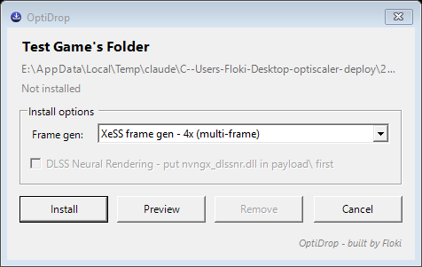

# OptiDrop

**Built by Floki.**

> ### ▶ Quick start: download, extract, double-click `OptiDrop.vbs`. That's it.
> 1. Download **`OptiDrop-v1.0.zip`** from [Releases](../../releases/latest).
> 2. Right-click it → **Extract All**.
> 3. Open the extracted folder and **double-click `OptiDrop.vbs`**.
>
> The OptiDrop bubble appears in the bottom-right corner of your screen. Drag a game folder onto it.
> There's no installer, no setup and no admin prompt, and nothing else to download.

A floating drop target for [OptiScaler](https://github.com/optiscaler/OptiScaler). Drag a game folder
onto the bubble, pick your frame generation, and click **Install**. Drag the same folder on again and
click **Remove** to undo it exactly.

- **Frame generation on any DX11/DX12 GPU.** FSR 3.1 FG, or XeSS FG at **2x, 3x or 4x (multi-frame)**.
  This includes RTX 20/30 cards, where NVIDIA's own DLSS Frame Generation refuses to run.
- **DLSS Neural Rendering support.** Uses the NR-enabled OptiScaler build by
  [Dagherbou](https://github.com/Dagherbou/OptiScaler_DLSSNR). You switch it on from the in-game
  **Insert** menu.
- **Picks the right proxy DLL for you.** It reads the game's real import table, won't overwrite
  another mod (like ReShade), avoids slots that third-party loaders use, and warns about anti-cheat.
- **Exact uninstall.** Every file it adds or renames is recorded in the game folder, so **Remove**
  puts everything back the way it was.



---

## Install

1. Download **`OptiDrop-vX.Y.zip`** from [Releases](../../releases/latest). It includes the
   OptiScaler files, so there's nothing else to get.
2. Extract it anywhere you want to keep it, for example `C:\Tools\OptiDrop`. Extract it first:
   double-clicking inside the zip without extracting won't work.
3. **Double-click `OptiDrop.vbs`.** That's the whole install. A round icon appears in the
   bottom-right corner of your screen. Do the same any time you want it back after closing it.
4. Optional: to get a Desktop shortcut with the OptiDrop icon, run this once:
   ```powershell
   powershell -ExecutionPolicy Bypass -File .\OptiDrop.ps1 -InstallShortcut
   ```

Needs Windows 10/11 and Windows PowerShell 5.1, which is already on every Windows install. Nothing
else needs installing.

> **Single-player games only.** OptiScaler works by adding a proxy DLL to the game. In online games
> with anti-cheat (EasyAntiCheat, BattlEye, ...) that can get your account banned. OptiDrop refuses
> by default when it finds anti-cheat files.

---

## Using the bubble

| Do this | What happens |
|---|---|
| **Drag a game folder onto it** (or the game's `.exe`) | The OptiDrop window opens for that game |
| **Double-click** it | Browse for a game folder instead |
| **Left-drag** it | Move it anywhere. It remembers where you put it |
| **Hover** over it | It goes solid. When idle it's partly see-through |
| **Right-click** it | Menu: pick folder, always on top, open folder, README, project page, about, exit |

### The OptiDrop window

- **Top:** the game name and folder, plus whether OptiScaler is already installed there and with
  which settings.
- **Frame gen:**
  - *FSR 3.1 frame gen - 2x (any GPU)*: the safe default.
  - *XeSS frame gen - 2x / 3x / 4x*: 3x and 4x are **multi-frame generation**: 2 or 3 generated
    frames for every real one. Only XeSS FG can do more than 2x.
- **DLSS Neural Rendering:** copies your NR model into the game (see below). The checkbox is greyed
  out until `payload\nvngx_dlssnr.dll` exists.
- **Install / Reinstall:** deploys with the options above. **Preview** shows the full plan and
  changes nothing. **Remove** reverts it using the saved record. **Cancel** does nothing.

Each action opens its own console window with the full coloured log. It waits for you to press Enter
before it closes, so you can read what it did. OptiDrop remembers your last choices.

If the game folder needs admin rights (for example under `Program Files`), only that console asks for
admin. The bubble itself never runs as admin, because Windows blocks drag-and-drop into admin windows.

---

## In game: the Insert menu

Launch the game normally. There's no launcher and nothing to run alongside it. OptiScaler loads
itself.

### Keys

| Key | Does |
|---|---|
| **Insert** | Open / close the OptiScaler menu |
| **End** | Frame generation on / off |
| **Page Up** | FPS overlay on / off |
| **Page Down** | Cycle the FPS overlay: just FPS → simple → detailed → graph → full → Reflex timings |

You can change any of these keys in the menu's **Keybinds** section, or in `OptiScaler.ini` under
`[Menu]` (`ShortcutKey`, `FGShortcutKey`, `FpsShortcutKey`, `FpsCycleShortcutKey`).

### What's in the menu

Section names can vary slightly between OptiScaler builds. These are the ones that matter:

**Upscalers.** Choose which upscaler the game's DLSS/FSR/XeSS slot actually uses: FSR, XeSS, or DLSS
if the game ships `nvngx_dlss.dll`. OptiDrop presets a sensible one for the game, and you can change
it live. Use **Quality**, not DLAA. DLAA renders at full native resolution and costs the frame rate
that frame gen needs.

**Frame Generation**
- OptiDrop sets **FG input = Upscaler** and **HUD fix = on**. That combination works even in games
  that have no frame generation of their own. Leave HUD fix on, or UI elements smear.
- **FG output** is FSR FG or XeSS FG, whichever you picked in OptiDrop. You can switch it here too.
- For XeSS FG, the frame multiplier (2x/3x/4x) is here as well.
- **End** toggles FG instantly, so you can compare with it off.

**DLSS Neural Rendering.** Only does something once the model is installed (see below).
- **Enable Neural Rendering**: off by default. Tick it to start the pass. If something is missing,
  a reason appears under the checkbox.
- **Detail strength**: how far the picture moves toward the model's version. 0 = exactly the
  upscaler's output (a true bypass), 1 = the model's picture. Push it to see more effect.
- **Colour strength**: 0 keeps the game's own colours with added detail, 1 takes the model's colours
  as well.
- **Model resolution**: runs the model at a fraction of the frame to save time. Your frame is never
  reduced. Above 100% it supersamples (DX12/Vulkan).
- **Highlight guard**: caps how much brighter any pixel can get. It stops bright lights from
  breaking into coloured blocks.
- **Intensity / Style / Preset**: NVIDIA's own model parameters. Changing one rebuilds the model
  after a short pause.
- **Debug view → Difference**: shows what the model changed. A flat grey screen means it's doing
  nothing.

Settings you change in the menu are written back to `OptiScaler.ini` next to the game's exe.

### Getting a good result

- **Frame gen needs a decent base frame rate. About 60 fps before FG is the minimum.** FG creates
  frames in between two real ones. At 30 fps those are 33 ms apart, it guesses wrong, and you get
  smeary artefacts. Lower settings until you're near 60, then add FG.
- Multi-frame (3x/4x) needs an even steadier base, and works best on high-refresh displays.

---

## DLSS Neural Rendering: setup

NR is NVIDIA's neural rendering model, run over the upscaler's output to add detail. The pass is
built into the OptiScaler in this package. **The model file itself is NVIDIA's and can't be shipped
here, so you have to supply it.**

1. Get `nvngx_dlssnr.dll` (about 160 MB) from an NVIDIA driver package that ships it. Check it:
   right-click → Properties → Details should say **NVIDIA DLSSNR**. A file that size under another
   `nvngx` name is usually the NR model misnamed, not the thing its name says.
2. Put it in OptiDrop's **`payload\`** folder.
3. In OptiDrop, tick **DLSS Neural Rendering** and click Install. Or from a terminal:
   `.\Add-OptiScaler.ps1 "<game>" -NeuralRendering`.
4. In game: **Insert** → *DLSS Neural Rendering* → **Enable Neural Rendering**.

What it needs:
- **An RTX 50 series card.**
- A **DirectX 12 game that already uses DLSS**. NR reads the depth and motion vectors the game hands
  to DLSS, so in a game without DLSS it does nothing. DX11 works through OptiScaler's D3D11-on-12
  path, and Vulkan is supported.

> **On older cards, don't.** Turning NR on with an RTX 3090 hard-locked the whole PC several
> times: black screen, no blue screen, hard reset needed. OptiDrop warns you and never turns NR on
> for you. The model only runs once you tick it in the menu.

---

## Command line

Everything the bubble does is `Add-OptiScaler.ps1`:

```powershell
.\Add-OptiScaler.ps1 "D:\Games\MyGame" -DryRun                       # preview, change nothing
.\Add-OptiScaler.ps1 "D:\Games\MyGame"                               # FSR FG 2x
.\Add-OptiScaler.ps1 "D:\Games\MyGame" -FGOutput xefg -MFG 4x        # XeSS multi-frame 4x
.\Add-OptiScaler.ps1 "D:\Games\MyGame" -NeuralRendering              # + your NR model
.\Add-OptiScaler.ps1 "D:\Games\MyGame" -Uninstall                    # exact revert
```

| Flag | Use |
|---|---|
| `-DryRun` | Print the plan only |
| `-Uninstall` | Revert exactly, from the record in the game folder |
| `-FGOutput fsrfg\|xefg` | FSR 3.1 FG (default) or XeSS FG |
| `-MFG 2x\|3x\|4x` | Multi-frame generation (XeSS FG only) |
| `-NeuralRendering` / `-ModelPath <dll>` | Copy your NR model in |
| `-Exe "Game-Win64-Shipping.exe"` | Override exe detection if it picked a launcher |
| `-ProxyName winmm.dll` | Force a proxy slot when the chosen one clashes |
| `-Force` | Continue past an anti-cheat warning (single-player only!) |

The old drag-onto-a-`.bat` files (`ADD` / `PREVIEW` / `REMOVE ... drop game folder here.bat`) still
work too.

---

## What it works out for you

- **The real exe.** It takes the largest non-launcher, prefers `*-Win64-Shipping.exe`, and skips
  crash reporters, web helpers and installers.
- **A proxy name the game will actually load.** It walks the exe's real PE import table. Games that
  import nothing useful (Unity/Unreal launcher stubs) still work via `dxgi.dll`, because Windows
  searches the game's own folder first.
- **Occupied slots.** It reads each DLL's product name, so it won't overwrite a ReShade that already
  lives in `dxgi.dll`. It will replace an older OptiScaler.
- **Third-party loaders / Steam emulators.** When it detects them (oversized `steam_api64`,
  `*Fix*` loaders, DLLs renamed to odd extensions), it keeps away from the graphics slots and uses
  `wininet.dll` instead, because those loaders patch the graphics imports themselves and would crash.
- **Anti-cheat.** It refuses when it finds EasyAntiCheat / BattlEye / EOS Anti-Cheat files. Epic
  Online Services (`EOSSDK`) is achievements and friends, not anti-cheat, and isn't blocked.
- **Graphics API** is only treated as a hint. Some games import `d3d11.dll` but run D3D12, so all
  three upscaler settings are configured and OptiScaler picks the right one at runtime.
- **Verified config.** After writing `OptiScaler.ini` it reads the file back and checks every frame
  gen setting. A frame gen setting that silently didn't apply can hang a game on startup.
- **Never installs** a *preview* DirectX Agility runtime. Those need Windows Developer Mode, and games
  ship their own anyway.

## Troubleshooting

**Game won't start after installing.** The proxy slot clashed with something. Remove, then retry
with another slot:
```powershell
.\Add-OptiScaler.ps1 "<game>" -Uninstall
.\Add-OptiScaler.ps1 "<game>" -ProxyName winmm.dll     # or version.dll / wininet.dll
```

**Insert does nothing and there's no `OptiScaler.log` next to the exe.** The DLL never loaded. Try
another `-ProxyName`. If the log exists but the menu doesn't open, check `[Menu] OverlayMenu` in
`OptiScaler.ini`. OptiScaler turns off all frame gen features without the overlay menu.

**Picked the wrong exe (a launcher).** Drop the actual game `.exe` onto the bubble instead of the
folder, or use `-Exe`.

**Frame gen looks smeary / "acid trip".** Your base frame rate is too low. See *Getting a good
result* above.

**Close the game before installing or removing.** OptiDrop refuses if the game is running, because
games rewrite their config when they exit.

---

## Credits & licences

- **OptiDrop** (the scripts in this repo): built by **Floki**, MIT licence, see [LICENSE](LICENSE).
- **OptiScaler** by the [OptiScaler team](https://github.com/optiscaler/OptiScaler), with the
  **DLSS Neural Rendering** pass by [Dagherbou](https://github.com/Dagherbou/OptiScaler_DLSSNR).
  GPL-3.0. The release zip ships the unmodified binaries from
  [OptiScaler_DLSSNR v0.2.0-dlssnr](https://github.com/Dagherbou/OptiScaler_DLSSNR/releases/tag/v0.2.0-dlssnr),
  and the source is there.
- NR colour composition from [RenoDX](https://github.com/clshortfuse/renodx) by clshortfuse (MIT).
- AMD FidelityFX and Intel XeSS / XeLL runtimes under their own licences.

Full texts are in [`licenses/`](licenses/). Details are in
[THIRD-PARTY-NOTICES.md](THIRD-PARTY-NOTICES.md).

Not affiliated with NVIDIA, AMD, Intel or the OptiScaler project. Use at your own risk.
